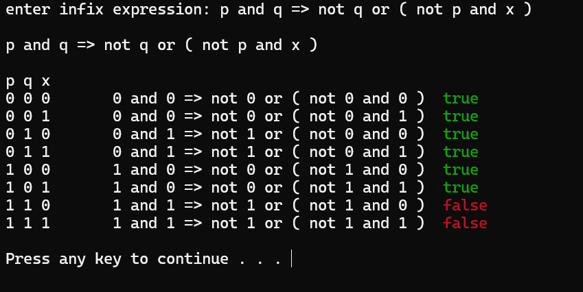

# Logical-expression-calculator
## Discrete math
I wrote this program during my first year of studies for my friends for discrete mathematics exam. The engine of the program is simply the algorithm of Reverse Polish Notation.


### How to use it
each element in expression must be separate by " ", example:

```bash
p and not ( p => q ) or not t
```
You can compile program only on windows.
For now calculator supports 6 logical operations:
  - or
  - and
  - =>
  - not
  - eqc
  - xor

  ### How it looks like ?
  
